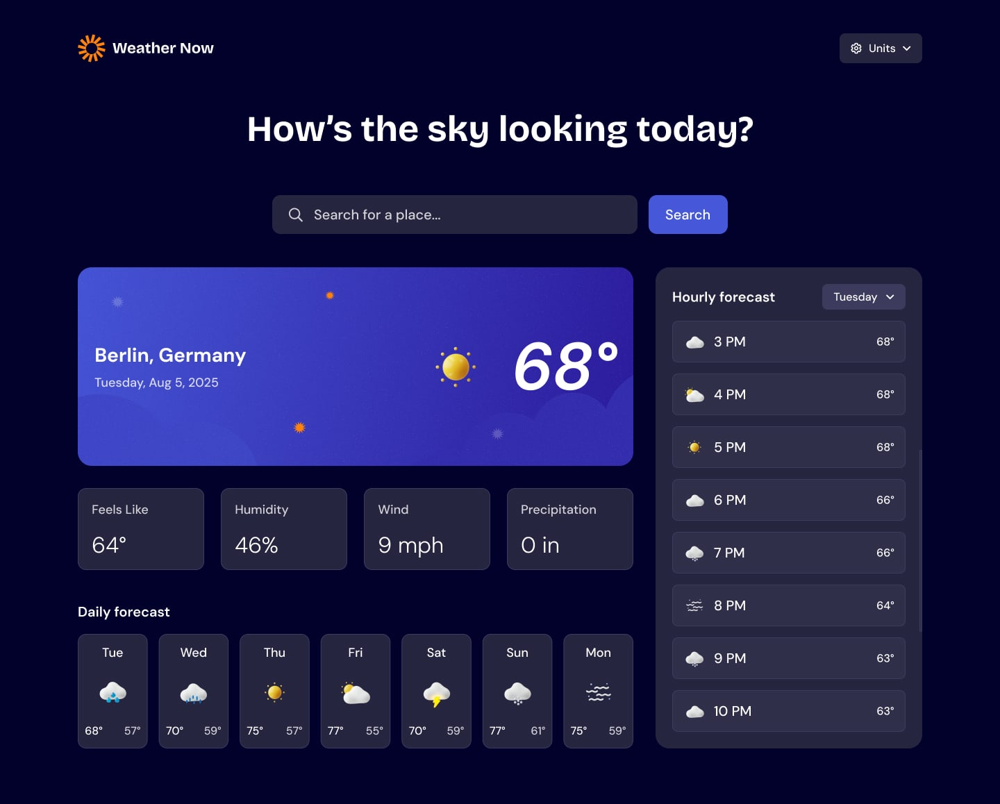

# Weather App

A responsive weather application built with React that allows users to search for locations and view current weather conditions, detailed weather information, and hourly forecasts.

The app includes loading and error states, customizable weather units, recent search autocomplete, and responsive layouts for mobile, tablet, and desktop screens.

## Preview

## Live Demo

[View the live website](https://abdalla-shaker.github.io/mentor-weather-app)

## Built With

- React
- Redux Toolkit
- JavaScript
- HTML5
- CSS3
- REST API
- Local Storage
- Vite

## Features

- Search for locations and fetch their weather data
- Display current weather conditions
- Display feels-like temperature, humidity, wind speed, and precipitation
- View hourly weather forecasts in 3-hour intervals
- View hourly forecasts for the current day and the following 6 days
- Switch between different temperature, precipitation, and wind speed units
- Automatically refetch weather data when units are changed
- Recent search autocomplete
- Store the last 4 searched locations in local storage
- Automatically remove invalid locations from search history
- Handle invalid or non-existent locations
- Handle API errors separately from location errors
- Loading states while weather data is being fetched
- Accessible loading and error states for screen readers
- Fully responsive design for different screen sizes

## State Management

The application uses **Redux Toolkit** for managing global application state.

The weather-related state includes:

- Weather data
- Loading state
- Error state
- Selected weather units
- Search state
- Recent search history

Using Redux Toolkit helped keep the state management centralized and made it easier for different components to access and update shared data.

## Weather Data

The application fetches weather information from a weather API based on the location entered by the user.

The `useWeather` custom hook is responsible for handling the weather data fetching process and managing the different states throughout the request lifecycle.

The application distinguishes between:

- Successful API requests
- API errors
- Invalid or non-existent locations
- Loading states

This allows the UI to provide a more specific message depending on what went wrong.

## Search

The search functionality allows users to search for a location and retrieve its weather information.

The application also keeps track of the **4 most recent valid searches** using `localStorage`.

When the user starts typing, previously searched locations can be displayed as autocomplete suggestions.

Invalid locations are not kept in the search history and are automatically removed from `localStorage`.

## Unit Selection

Users can change the units used to display:

- Temperature
- Precipitation
- Wind speed

The selected units are stored in the application state. When a unit is changed, the application requests the weather data again using the newly selected units.

## Accessibility

Accessibility was considered throughout the application.

ARIA attributes are used for important dynamic states such as:

- Loading
- Errors
- Weather data updates

This helps communicate changes in the application's state to users who rely on screen readers.

## Responsive Design

The application was designed to work across different screen sizes.

The layout adapts to:

- Mobile devices
- Tablets
- Desktop screens

The weather details and hourly forecast sections adjust their layout based on the available screen space.

## What I Learned

This project helped me strengthen my understanding of React and application state management.

Some of the main things I practiced were:

- Managing global state with Redux Toolkit
- Creating and using custom React hooks
- Working with REST APIs
- Handling asynchronous requests
- Designing separate loading, success, and error states
- Refetching API data when application state changes
- Persisting data using `localStorage`
- Building reusable React components
- Making interfaces responsive
- Improving accessibility with ARIA attributes

## Challenges

One of the main challenges was handling the different states of the weather request correctly.

The application needs to distinguish between an API failure and a location that simply does not exist. I also had to make sure that the loading state was reset correctly after a request finished, regardless of whether the request succeeded or failed.

Another challenge was managing the hourly forecast data across multiple days and displaying the correct 3-hour intervals for each day.

Implementing unit switching also required the weather data to be fetched again whenever the selected units changed.

## Continued Development

Some areas I would like to continue improving include:

- Improving the search experience
- Adding more detailed weather information
- Further improving accessibility
- Adding additional animations and transitions
- Optimizing API requests and application performance

## Challenge

This project was built as part of a Frontend Mentor challenge.

[View the original challenge](https://www.frontendmentor.io/challenges/weather-app-K1FhddVm49)
